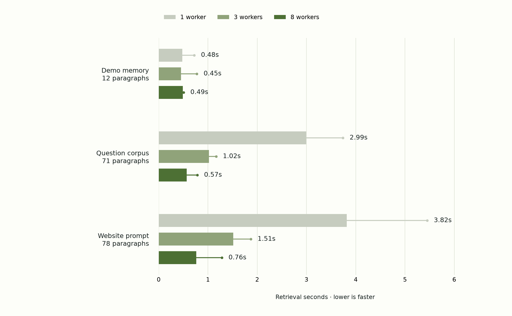

# Parallel Jev and request latency — September 20, 2026

**Eight workers reduced the website-prompt median cold retrieval from 3819 ms sequential to 763 ms (5.01× faster), and from 1514 ms with the previous three-worker default (1.99× faster).**

The default is now eight concurrent Jev HTTP batches per query, with 12 independent paragraph questions per batch. Every paragraph in the selected collection is judged. The worker bound is configurable from 1 to 32. A six-batch corpus reaches six simultaneous calls; seven batches reach seven. The 12-paragraph demo only needs one call, so raising its worker limit cannot create useful additional concurrency.



## Cold retrieval measurements

Bars show medians. Thin extensions and dots show the empirical 95th percentile. Nine runs per corpus/configuration: three fixed requests × three repetitions. This is an exploratory latency sample, not a production SLA.

| Corpus | Worker limit | Runs | Median | P95 | Observed peak overlapping calls |
| --- | ---: | ---: | ---: | ---: | ---: |
| Demo memory · 12 paragraphs | 1 | 9 | 476 ms | 722 ms | 1 |
| Demo memory · 12 paragraphs | 3 | 9 | 452 ms | 775 ms | 1 |
| Demo memory · 12 paragraphs | 8 | 9 | 489 ms | 506 ms | 1 |
| Question corpus · 71 paragraphs | 1 | 9 | 2994 ms | 3740 ms | 1 |
| Question corpus · 71 paragraphs | 3 | 9 | 1022 ms | 1166 ms | 3 |
| Question corpus · 71 paragraphs | 8 | 9 | 566 ms | 784 ms | 6 |
| Website prompt · 78 paragraphs | 1 | 9 | 3819 ms | 5448 ms | 1 |
| Website prompt · 78 paragraphs | 3 | 9 | 1514 ms | 1872 ms | 3 |
| Website prompt · 78 paragraphs | 8 | 9 | 763 ms | 1280 ms | 7 |

## Immediate local-cache repeats

Each of the 27 eight-worker cold queries was immediately repeated. Every repeat returned the same context, zero dispatched provider calls, and zero new Jev usage. Cache lookup and assembly still take time.

| Corpus | Repeats | Median | P95 |
| --- | ---: | ---: | ---: |
| Demo memory · 12 paragraphs | 9 | 0.66 ms | 2.11 ms |
| Question corpus · 71 paragraphs | 9 | 1.14 ms | 1.71 ms |
| Website prompt · 78 paragraphs | 9 | 52.36 ms | 62.75 ms |

## Time to a complete answer

A separate paired experiment used 12 questions stratified before inference across lookups, multi-paragraph questions, calculations, policy exceptions, and missing-information checks. It reused the public QA corpus and frozen gold answers, with Gemini 3.8 Flash in both arms. Each question has one full-context answer and one answer preceded by fresh eight-worker Jev retrieval. Arm order was randomized within pairs. Requests ran serially to avoid benchmark-generated contention. This measures complete responses, not time to first token; reasoning/output length and remote routing can affect it.

| Arm | Complete answers | Median total | P95 total | Median generation portion | Exact accuracy |
| --- | ---: | ---: | ---: | ---: | ---: |
| Full context | 12 | 3.03 s | 3.56 s | 3.03 s | 12/12 |
| Dynamic, including cold Jev | 12 | 2.90 s | 11.26 s | 2.38 s | 11/12 |

The **median paired dynamic-minus-full difference is +0.00 seconds**. This differs from subtracting the two arm medians. 6 of the 12 dynamic requests took longer than their full-context partner. Parallel selection reduces retrieval overhead; it does not establish that requests never slow down. No retrieval can overlap an answer that depends on its result. These questions are a small latency subset, not a replacement for the [32-question accuracy benchmark](question-accuracy-2026-09-20.md). Current subset accuracy and every returned answer are included to avoid presenting faster but incorrect answers as an equivalent-quality win.

## Protocol, instrumentation, and limits

- Cold retrieval run order was shuffled with seed 20260920 across all three corpora, three requests, three repetitions, and worker counts 1/3/8: **81 cold queries**. No other experiment ran concurrently. Eight-worker cold queries also enabled cache writing, as production does, before the immediate warm repeat; other configurations disabled local caching. This minor extra write overhead counts against the new default.
- All cold runs checked that the number of unique judged paragraph IDs exactly equals the collection size. Individual requests contain independent Noul questions. A bounded thread pool runs batches concurrently; timestamps and observed peak overlapping calls demonstrate client-side overlap. They do not prove provider-internal scheduling.
- The batch size, relevance policy, threshold (0.50), full request text, and 1,000,000-token budget are unchanged between configurations. Model scoring can vary across fresh calls; changing worker count is not intended to change selection semantics. Required coverage means every paragraph was judged, not that every necessary paragraph was selected.
- Corpus sizes: 12 sample paragraphs, 71 public QA paragraphs, and 78 original website-generation prompt paragraphs. The website prompt is roughly 27k reference tokens and includes one very large paragraph; it is not a synthetic small-text stand-in. The three original website requests remain private; hashes and public site slugs identify them. No private prompt or request text appears in this report or its JSON.
- Benchmarks ran on the user's Mac against public provider APIs. HTTP/TLS, network transit, provider scheduling/inference, SQLite lookup, JSON work, and exact token-budget assembly are included in retrieval wall time. Tokenizer initialization was performed once outside the measurements. No forced provider-cache bypass or guarantees about remote load. These are warm-process measurements, not fresh process startup or first-ever tokenizer download.
- `timing_ms` separates setup, inference, cache writes, assembly, and total time. `execution` includes configured workers, planned/dispatched batches, paragraphs judged, observed peak in-flight batches, and each batch's start/end/duration. The timer covers each complete HTTP provider call, not just model compute. Live demo round-trip measurements additionally include browser-to-demo network transit.
- The engine's concurrency limit is per query. The hosted demo permits three simultaneous queries, so its aggregate ceiling is 24 calls with eight workers. It does not expose worker controls publicly. CLI users can configure `--workers`, `--batch-size`, `JEV_CONTEXT_WORKERS`, and `JEV_CONTEXT_BATCH_SIZE` according to provider quota.
- An error from any batch fails the query without emitting or caching partial scores. No speculative partial context, timeout fallback, or dropped paragraphs is used to achieve faster measurements. No relevance policy was tuned during this experiment.
- P95 uses linear interpolation between ordered samples. Nine cold samples per cell and 12 answer pairs are small; tail estimates are unstable and should not be treated as a guarantee. There is no representative concurrent-user load test or statistical equivalence claim.

## Reproduce

```sh
# Set TYPESAFE_API_KEY and ANSWER_API_KEY privately.
export ANSWER_API_BASE_URL=https://openrouter.ai/api/v1
python3 benchmarks/latency.py \
  --archive /private/website-replay-cases.json \
  --output artifacts/latency-reproduction
```

Omit `--archive` to run only the two fully public corpora. Use a new output directory for an independent run. An existing output directory resumes recorded completed calls and rejects changed protocols. The report checkpoints after each measured query. The plotting/report script is tailored to the published three-corpus run.

- [Raw measurements, batch intervals, answer receipts, and source hashes](results/latency-2026-09-20.json)
- [Benchmark harness](latency.py)
- [Public QA fixture](fixtures/question-answering-2026-09-20.json)
- [Model selection policy](../jev_context/policy.json)

## Per-question complete-answer times

| Question | Full | Dynamic including Jev | Delta | Full correct | Dynamic correct |
| --- | ---: | ---: | ---: | ---: | ---: |
| doc-fact | 2.29 s | 2.68 s | +0.39 s | True | True |
| skin-fact | 2.08 s | 2.02 s | -0.07 s | True | True |
| deck-fact | 1.83 s | 1.91 s | +0.08 s | True | True |
| prosthetic-fact | 3.04 s | 2.83 s | -0.22 s | True | True |
| vehicle-multi | 2.49 s | 7.86 s | +5.37 s | True | True |
| skin-multi | 3.14 s | 3.19 s | +0.04 s | True | True |
| orbit-offsite | 2.88 s | 5.29 s | +2.42 s | True | True |
| prosthetic-multi | 3.55 s | 15.41 s | +11.86 s | True | False |
| orbit-refund | 3.31 s | 2.93 s | -0.38 s | True | True |
| orbit-renewal | 3.02 s | 2.75 s | -0.28 s | True | True |
| doc-unknown | 3.58 s | 2.87 s | -0.71 s | True | True |
| vehicle-unknown | 3.31 s | 3.27 s | -0.04 s | True | True |
